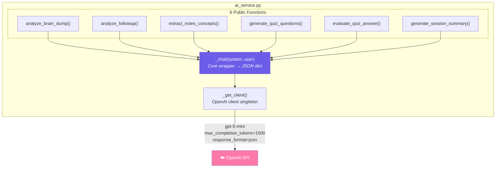
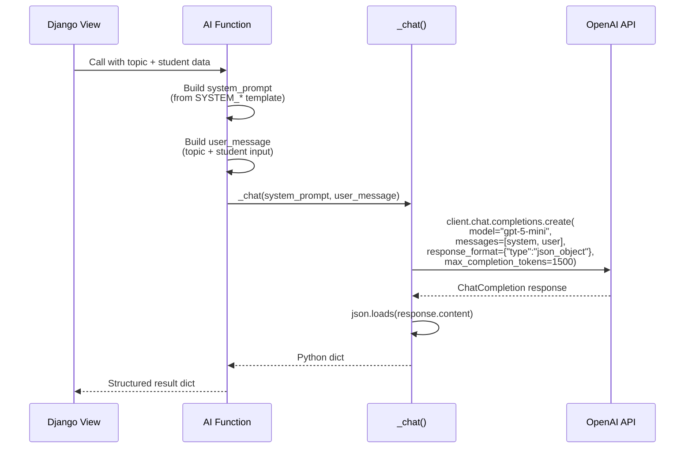
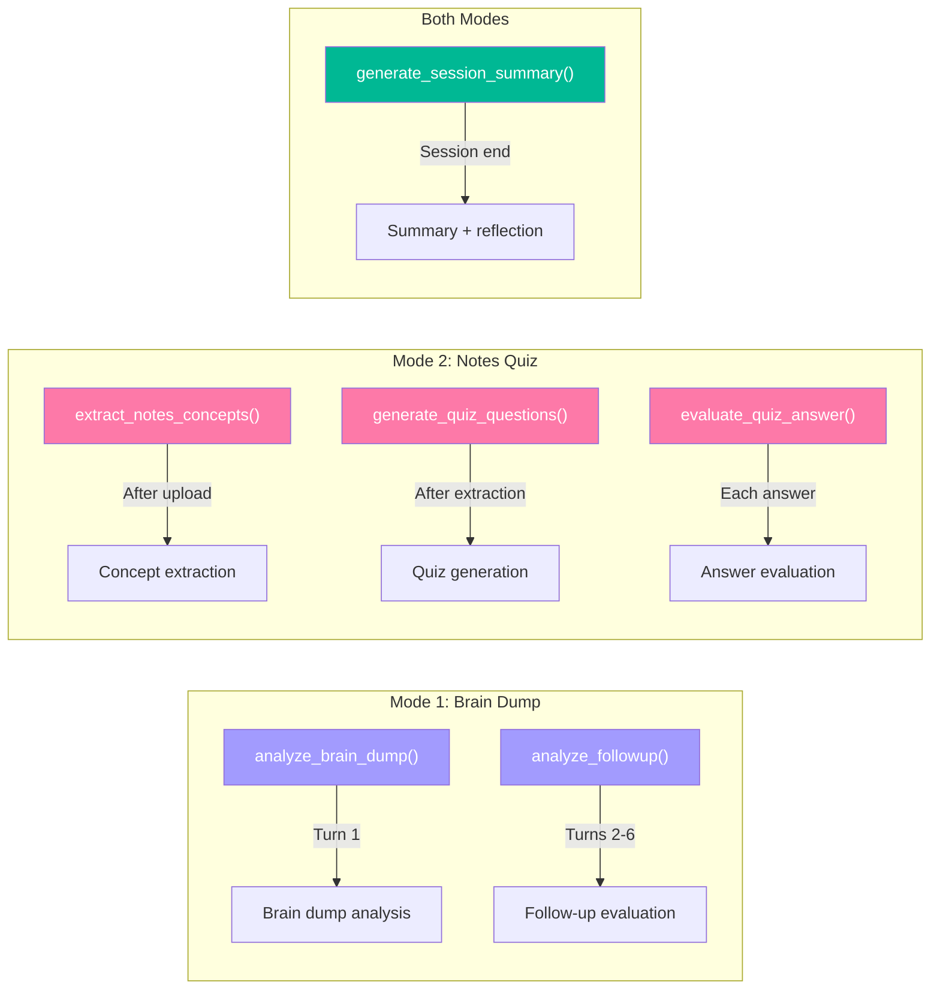
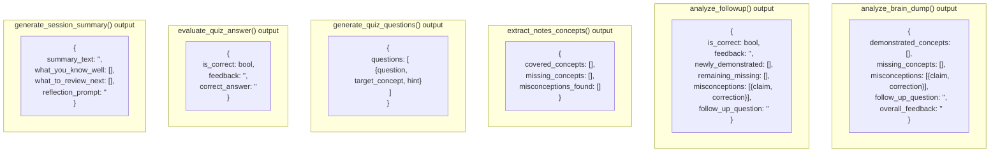
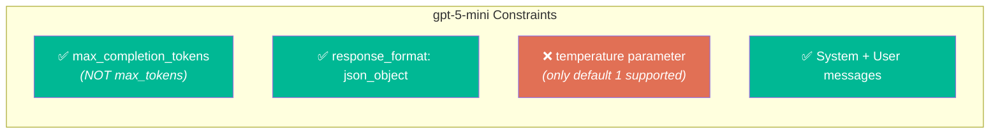

# AI Pipeline

## AI Service Overview

```mermaid
graph TB
    subgraph "ai_service.py"
        Client["_get_client()<br/><i>OpenAI client singleton</i>"]
        Chat["_chat(system, user)<br/><i>Core wrapper → JSON dict</i>"]

        subgraph "6 Public Functions"
            F1["analyze_brain_dump()"]
            F2["analyze_followup()"]
            F3["extract_notes_concepts()"]
            F4["generate_quiz_questions()"]
            F5["evaluate_quiz_answer()"]
            F6["generate_session_summary()"]
        end
    end

    F1 --> Chat
    F2 --> Chat
    F3 --> Chat
    F4 --> Chat
    F5 --> Chat
    F6 --> Chat
    Chat --> Client
    Client -->|"gpt-5-mini<br/>max_completion_tokens=1500<br/>response_format=json"| API["☁️ OpenAI API"]

    style Chat fill:#6c5ce7,color:#fff
    style API fill:#fd79a8,color:#fff
```

## Prompt → Response Flow

```mermaid
sequenceDiagram
    participant View as Django View
    participant Fn as AI Function
    participant Chat as _chat()
    participant API as OpenAI API

    View->>Fn: Call with topic + student data
    Fn->>Fn: Build system_prompt<br/>(from SYSTEM_* template)
    Fn->>Fn: Build user_message<br/>(topic + student input)
    Fn->>Chat: _chat(system_prompt, user_message)
    Chat->>API: client.chat.completions.create(<br/>model="gpt-5-mini",<br/>messages=[system, user],<br/>response_format={"type":"json_object"},<br/>max_completion_tokens=1500)
    API-->>Chat: ChatCompletion response
    Chat->>Chat: json.loads(response.content)
    Chat-->>Fn: Python dict
    Fn-->>View: Structured result dict
```

## Functions by Mode

```mermaid
graph LR
    subgraph "Mode 1: Brain Dump"
        BD1["analyze_brain_dump()"] -->|"Turn 1"| R1["Brain dump analysis"]
        BD2["analyze_followup()"] -->|"Turns 2-6"| R2["Follow-up evaluation"]
    end

    subgraph "Mode 2: Notes Quiz"
        NQ1["extract_notes_concepts()"] -->|"After upload"| R3["Concept extraction"]
        NQ2["generate_quiz_questions()"] -->|"After extraction"| R4["Quiz generation"]
        NQ3["evaluate_quiz_answer()"] -->|"Each answer"| R5["Answer evaluation"]
    end

    subgraph "Both Modes"
        SUM["generate_session_summary()"] -->|"Session end"| R6["Summary + reflection"]
    end

    style BD1 fill:#a29bfe,color:#fff
    style BD2 fill:#a29bfe,color:#fff
    style NQ1 fill:#fd79a8,color:#fff
    style NQ2 fill:#fd79a8,color:#fff
    style NQ3 fill:#fd79a8,color:#fff
    style SUM fill:#00b894,color:#fff
```

## AI Response Schemas

```mermaid
graph TD
    subgraph "analyze_brain_dump() output"
        ABD["{<br/>  demonstrated_concepts: [],<br/>  missing_concepts: [],<br/>  misconceptions: [{claim, correction}],<br/>  follow_up_question: '',<br/>  overall_feedback: ''<br/>}"]
    end

    subgraph "analyze_followup() output"
        AF["{<br/>  is_correct: bool,<br/>  feedback: '',<br/>  newly_demonstrated: [],<br/>  remaining_missing: [],<br/>  misconceptions: [{claim, correction}],<br/>  follow_up_question: ''<br/>}"]
    end

    subgraph "extract_notes_concepts() output"
        ENC["{<br/>  covered_concepts: [],<br/>  missing_concepts: [],<br/>  misconceptions_found: []<br/>}"]
    end

    subgraph "generate_quiz_questions() output"
        GQQ["{<br/>  questions: [<br/>    {question, target_concept, hint}<br/>  ]<br/>}"]
    end

    subgraph "evaluate_quiz_answer() output"
        EQA["{<br/>  is_correct: bool,<br/>  feedback: '',<br/>  correct_answer: ''<br/>}"]
    end

    subgraph "generate_session_summary() output"
        GSS["{<br/>  summary_text: '',<br/>  what_you_know_well: [],<br/>  what_to_review_next: [],<br/>  reflection_prompt: ''<br/>}"]
    end
```

## Model Constraints

```mermaid
graph LR
    subgraph "gpt-5-mini Constraints"
        C1["✅ max_completion_tokens<br/><i>(NOT max_tokens)</i>"]
        C2["✅ response_format: json_object"]
        C3["❌ temperature parameter<br/><i>(only default 1 supported)</i>"]
        C4["✅ System + User messages"]
    end

    style C1 fill:#00b894,color:#fff
    style C2 fill:#00b894,color:#fff
    style C3 fill:#e17055,color:#fff
    style C4 fill:#00b894,color:#fff
```
