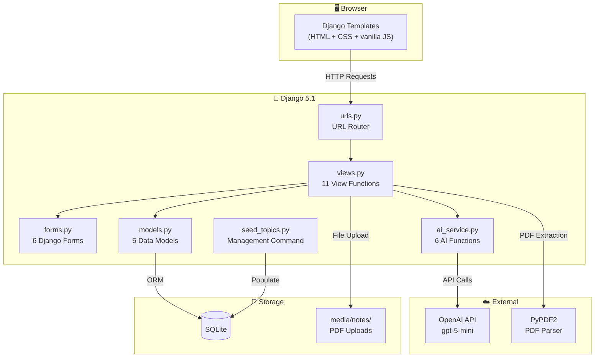
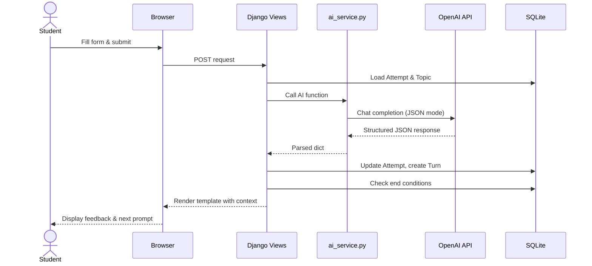
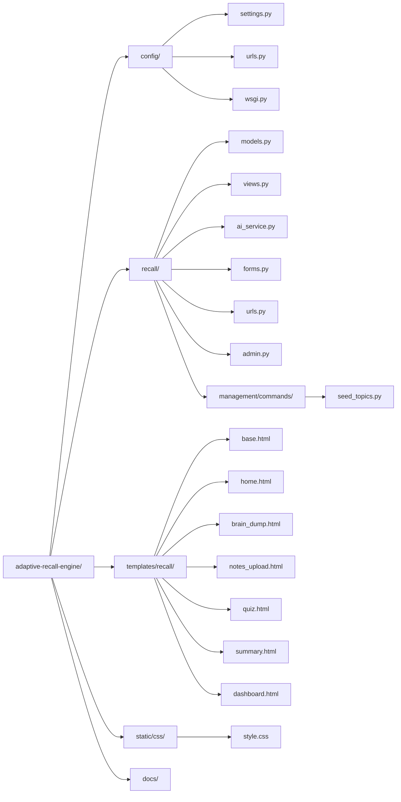

# Architecture Overview

## System Architecture

```mermaid
graph TB
    subgraph Client["🖥️ Browser"]
        UI["Django Templates<br/>(HTML + CSS + vanilla JS)"]
    end

    subgraph Django["🐍 Django 5.1"]
        direction TB
        URLs["urls.py<br/>URL Router"]
        Views["views.py<br/>11 View Functions"]
        Forms["forms.py<br/>6 Django Forms"]
        Models["models.py<br/>5 Data Models"]
        AI["ai_service.py<br/>6 AI Functions"]
        Seed["seed_topics.py<br/>Management Command"]
    end

    subgraph External["☁️ External"]
        OpenAI["OpenAI API<br/>gpt-5-mini"]
        PDF["PyPDF2<br/>PDF Parser"]
    end

    subgraph Storage["💾 Storage"]
        DB[(SQLite)]
        Media["media/notes/<br/>PDF Uploads"]
    end

    UI -->|HTTP Requests| URLs
    URLs --> Views
    Views --> Forms
    Views --> Models
    Views --> AI
    AI -->|API Calls| OpenAI
    Views -->|PDF Extraction| PDF
    Models -->|ORM| DB
    Views -->|File Upload| Media
    Seed -->|Populate| DB
```

## Request / Response Flow

```mermaid
sequenceDiagram
    actor Student
    participant Browser
    participant Django as Django Views
    participant AI as ai_service.py
    participant OpenAI as OpenAI API
    participant DB as SQLite

    Student->>Browser: Fill form & submit
    Browser->>Django: POST request
    Django->>DB: Load Attempt & Topic
    Django->>AI: Call AI function
    AI->>OpenAI: Chat completion (JSON mode)
    OpenAI-->>AI: Structured JSON response
    AI-->>Django: Parsed dict
    Django->>DB: Update Attempt, create Turn
    Django->>DB: Check end conditions
    Django-->>Browser: Render template with context
    Browser-->>Student: Display feedback & next prompt
```

## Directory Structure

```mermaid
graph LR
    Root["adaptive-recall-engine/"]

    Root --> Config["config/"]
    Root --> Recall["recall/"]
    Root --> Templates["templates/recall/"]
    Root --> Static["static/css/"]
    Root --> Docs["docs/"]

    Config --> Settings["settings.py"]
    Config --> RootURLs["urls.py"]
    Config --> WSGI["wsgi.py"]

    Recall --> ModelsF["models.py"]
    Recall --> ViewsF["views.py"]
    Recall --> AIF["ai_service.py"]
    Recall --> FormsF["forms.py"]
    Recall --> AppURLs["urls.py"]
    Recall --> Admin["admin.py"]
    Recall --> Mgmt["management/commands/"]
    Mgmt --> SeedCmd["seed_topics.py"]

    Templates --> Base["base.html"]
    Templates --> Home["home.html"]
    Templates --> BD["brain_dump.html"]
    Templates --> NU["notes_upload.html"]
    Templates --> Quiz["quiz.html"]
    Templates --> Summary["summary.html"]
    Templates --> Dash["dashboard.html"]

    Static --> CSS["style.css"]
```
