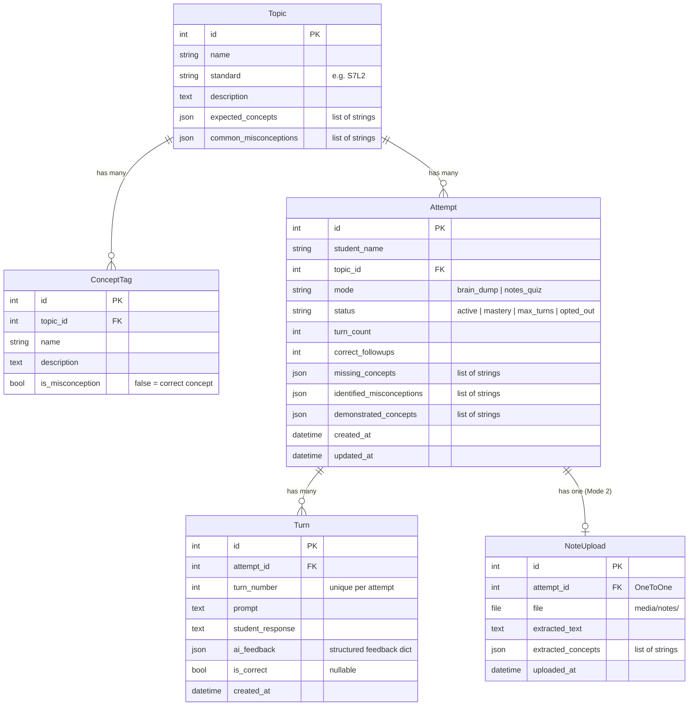
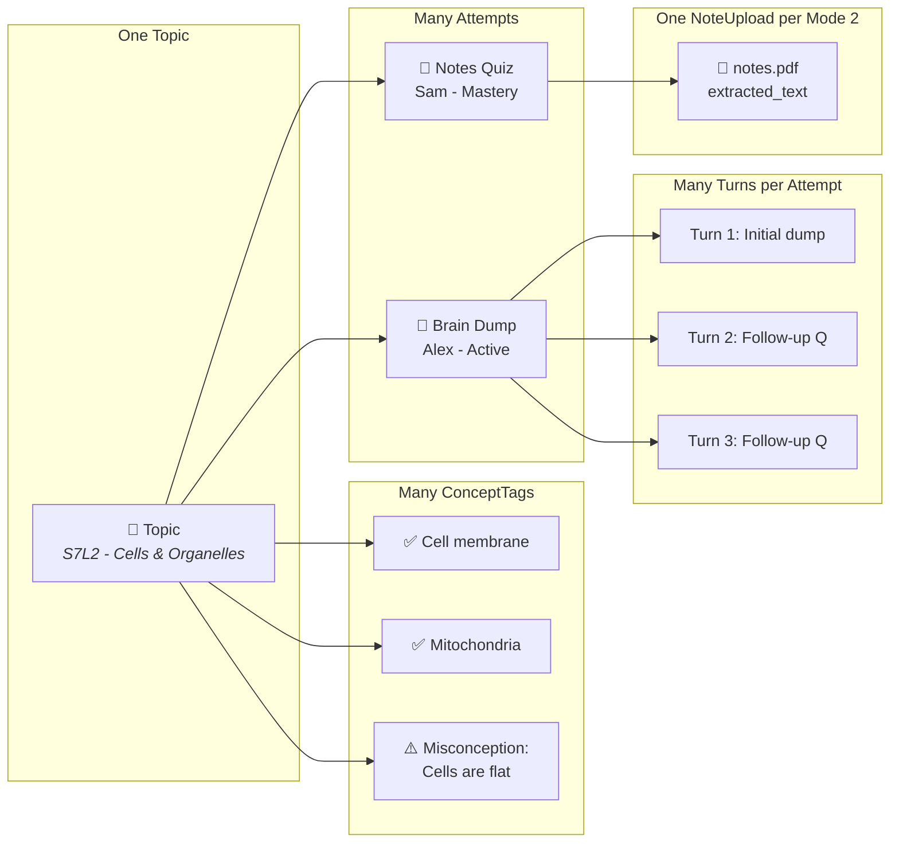
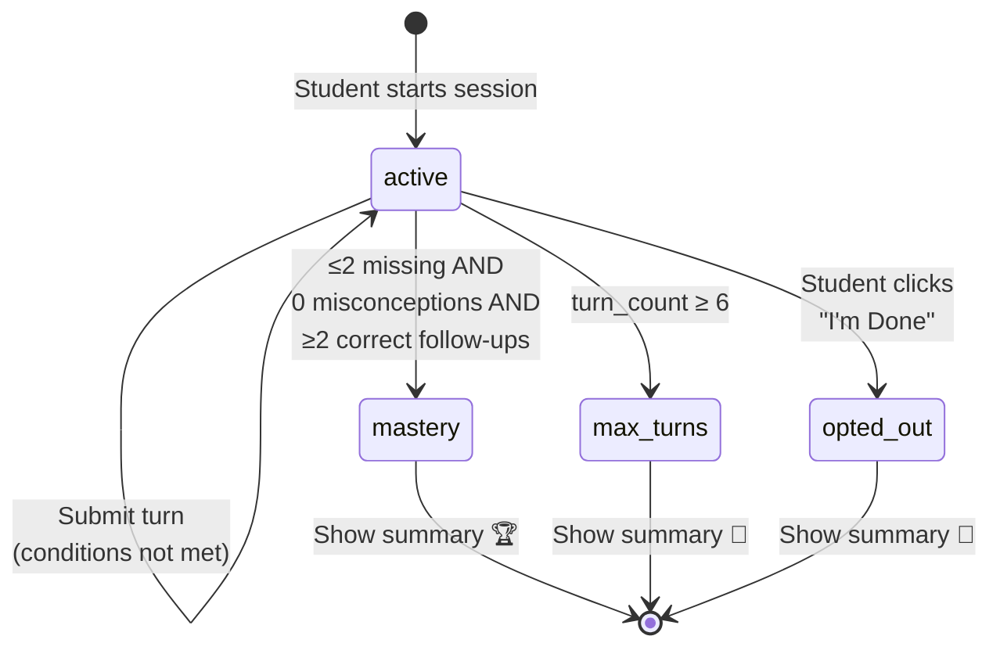
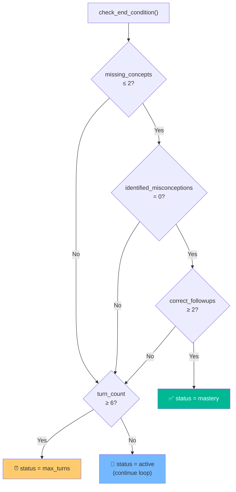

# Data Models

## Entity Relationship Diagram

```mermaid
erDiagram
    Topic ||--o{ ConceptTag : "has many"
    Topic ||--o{ Attempt : "has many"
    Attempt ||--o{ Turn : "has many"
    Attempt ||--o| NoteUpload : "has one (Mode 2)"

    Topic {
        int id PK
        string name
        string standard "e.g. S7L2"
        text description
        json expected_concepts "list of strings"
        json common_misconceptions "list of strings"
    }

    ConceptTag {
        int id PK
        int topic_id FK
        string name
        text description
        bool is_misconception "false = correct concept"
    }

    Attempt {
        int id PK
        string student_name
        int topic_id FK
        string mode "brain_dump | notes_quiz"
        string status "active | mastery | max_turns | opted_out"
        int turn_count
        int correct_followups
        json missing_concepts "list of strings"
        json identified_misconceptions "list of strings"
        json demonstrated_concepts "list of strings"
        datetime created_at
        datetime updated_at
    }

    Turn {
        int id PK
        int attempt_id FK
        int turn_number "unique per attempt"
        text prompt
        text student_response
        json ai_feedback "structured feedback dict"
        bool is_correct "nullable"
        datetime created_at
    }

    NoteUpload {
        int id PK
        int attempt_id FK "OneToOne"
        file file "media/notes/"
        text extracted_text
        json extracted_concepts "list of strings"
        datetime uploaded_at
    }
```

## Model Relationships

```mermaid
graph LR
    subgraph "One Topic"
        T["🧬 Topic<br/><i>S7L2 - Cells & Organelles</i>"]
    end

    subgraph "Many ConceptTags"
        CT1["✅ Cell membrane"]
        CT2["✅ Mitochondria"]
        CT3["⚠️ Misconception:<br/>Cells are flat"]
    end

    subgraph "Many Attempts"
        A1["🧠 Brain Dump<br/>Alex - Active"]
        A2["📄 Notes Quiz<br/>Sam - Mastery"]
    end

    subgraph "Many Turns per Attempt"
        T1["Turn 1: Initial dump"]
        T2["Turn 2: Follow-up Q"]
        T3["Turn 3: Follow-up Q"]
    end

    subgraph "One NoteUpload per Mode 2"
        NU["📎 notes.pdf<br/>extracted_text"]
    end

    T --> CT1
    T --> CT2
    T --> CT3
    T --> A1
    T --> A2
    A1 --> T1
    A1 --> T2
    A1 --> T3
    A2 --> NU
```

## Attempt Status Lifecycle

```mermaid
stateDiagram-v2
    [*] --> active : Student starts session

    active --> active : Submit turn<br/>(conditions not met)
    active --> mastery : ≤2 missing AND<br/>0 misconceptions AND<br/>≥2 correct follow-ups
    active --> max_turns : turn_count ≥ 6
    active --> opted_out : Student clicks<br/>"I'm Done"

    mastery --> [*] : Show summary 🏆
    max_turns --> [*] : Show summary 💪
    opted_out --> [*] : Show summary 👋
```

## Mastery Condition Detail

```mermaid
graph TD
    Check["check_end_condition()"]

    Check --> M1{"missing_concepts<br/>≤ 2?"}
    M1 -->|Yes| M2{"identified_misconceptions<br/>= 0?"}
    M1 -->|No| MC{"turn_count<br/>≥ 6?"}

    M2 -->|Yes| M3{"correct_followups<br/>≥ 2?"}
    M2 -->|No| MC

    M3 -->|Yes| Mastery["✅ status = mastery"]
    M3 -->|No| MC

    MC -->|Yes| MaxTurns["⏰ status = max_turns"]
    MC -->|No| Continue["🔄 status = active<br/>(continue loop)"]

    style Mastery fill:#00b894,color:#fff
    style MaxTurns fill:#fdcb6e,color:#333
    style Continue fill:#74b9ff,color:#333
```
