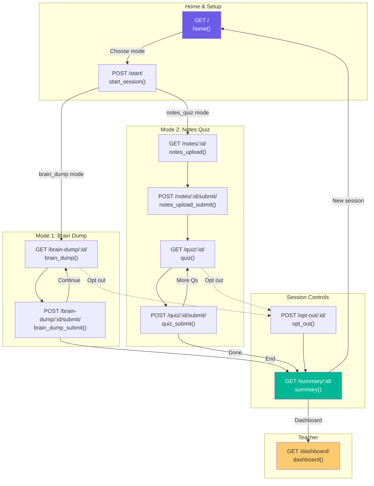
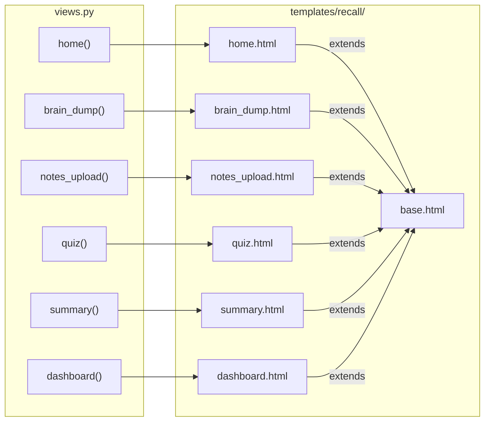

# URL Routes & Views

## Route Map

## View → Template Mapping

## HTTP Method Summary

| Route | Method | View | Purpose |
|-------|--------|------|---------|
| `/` | GET | `home()` | Landing page with start form |
| `/start/` | POST | `start_session()` | Create Attempt, redirect to mode |
| `/brain-dump/<id>/` | GET | `brain_dump()` | Show brain dump page |
| `/brain-dump/<id>/submit/` | POST | `brain_dump_submit()` | Process brain dump/follow-up |
| `/notes/<id>/` | GET | `notes_upload()` | Show upload form |
| `/notes/<id>/submit/` | POST | `notes_upload_submit()` | Upload PDF, extract, gen quiz |
| `/quiz/<id>/` | GET | `quiz()` | Show current quiz question |
| `/quiz/<id>/submit/` | POST | `quiz_submit()` | Evaluate answer |
| `/opt-out/<id>/` | POST | `opt_out()` | End session early |
| `/summary/<id>/` | GET | `summary()` | Generate & show summary |
| `/dashboard/` | GET | `dashboard()` | Teacher overview |
