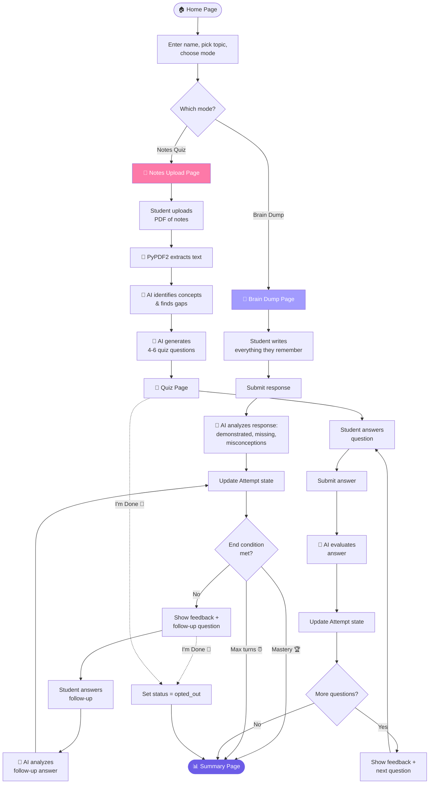
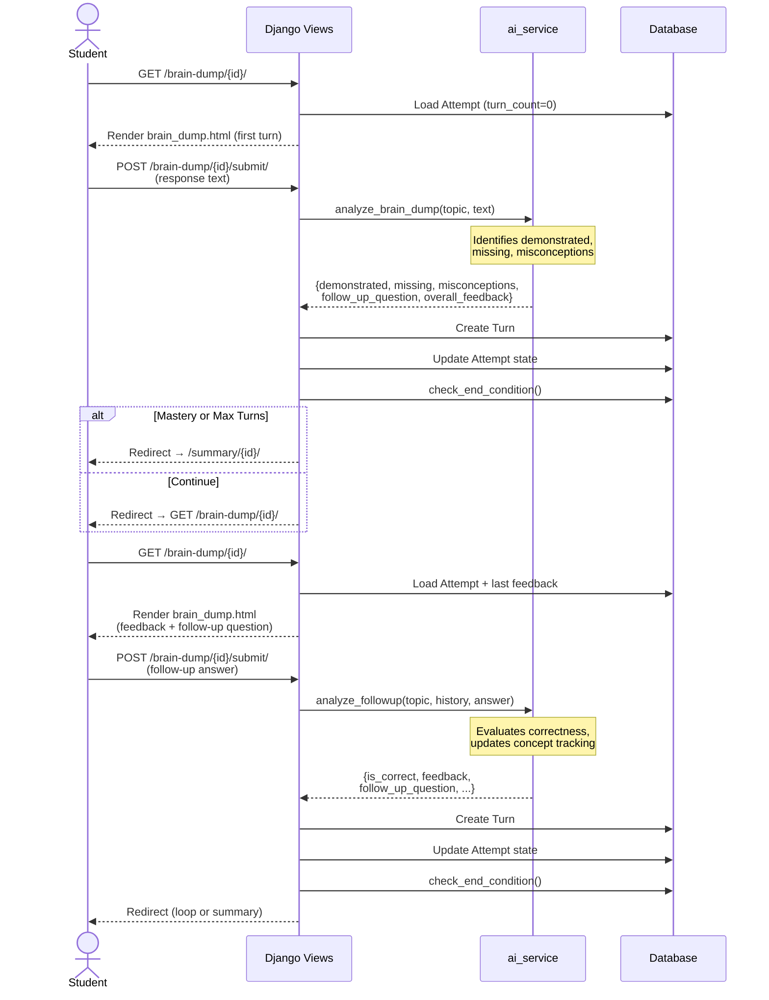
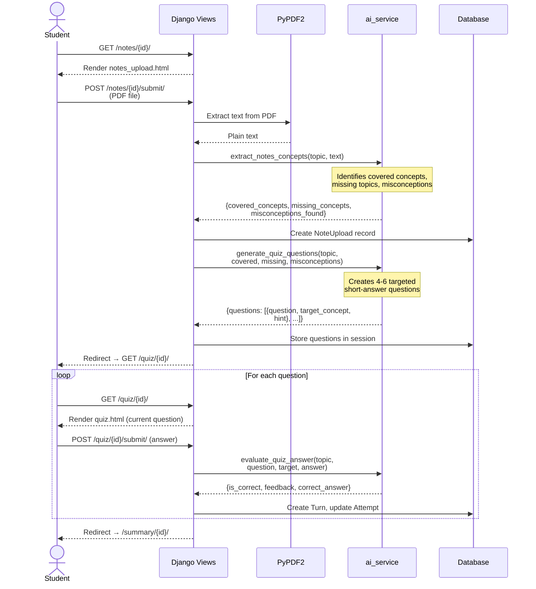
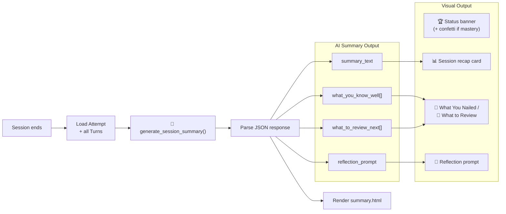

# User Flows

## Complete Application Flow

```mermaid
flowchart TD
    Start(["🏠 Home Page"]) --> Form["Enter name, pick topic,<br/>choose mode"]

    Form --> Mode{Which mode?}

    Mode -->|Brain Dump| BD["🧠 Brain Dump Page"]
    Mode -->|Notes Quiz| NU["📄 Notes Upload Page"]

    %% ── Mode 1: Brain Dump ──
    BD --> Dump["Student writes<br/>everything they remember"]
    Dump --> SubmitBD["Submit response"]
    SubmitBD --> AnalyzeBD["🤖 AI analyzes response:<br/>demonstrated, missing,<br/>misconceptions"]
    AnalyzeBD --> UpdateBD["Update Attempt state"]
    UpdateBD --> CheckBD{"End condition<br/>met?"}

    CheckBD -->|Mastery 🏆| Summary
    CheckBD -->|Max turns ⏰| Summary
    CheckBD -->|No| FollowUp["Show feedback +<br/>follow-up question"]
    FollowUp --> SubmitFU["Student answers<br/>follow-up"]
    SubmitFU --> AnalyzeFU["🤖 AI analyzes<br/>follow-up answer"]
    AnalyzeFU --> UpdateBD

    %% ── Mode 2: Notes Quiz ──
    NU --> Upload["Student uploads<br/>PDF of notes"]
    Upload --> Extract["📖 PyPDF2 extracts text"]
    Extract --> AIExtract["🤖 AI identifies concepts<br/>& finds gaps"]
    AIExtract --> GenQuiz["🤖 AI generates<br/>4-6 quiz questions"]
    GenQuiz --> Quiz["📝 Quiz Page"]

    Quiz --> Answer["Student answers<br/>question"]
    Answer --> SubmitQ["Submit answer"]
    SubmitQ --> EvalQ["🤖 AI evaluates<br/>answer"]
    EvalQ --> UpdateQ["Update Attempt state"]
    UpdateQ --> CheckQ{"More questions?"}
    CheckQ -->|Yes| NextQ["Show feedback +<br/>next question"]
    NextQ --> Answer
    CheckQ -->|No| Summary

    %% ── Summary ──
    Summary(["📊 Summary Page"])

    %% ── Opt-out ──
    FollowUp -.->|"I'm Done 👋"| OptOut["Set status = opted_out"]
    Quiz -.->|"I'm Done 👋"| OptOut
    OptOut --> Summary

    style Summary fill:#6c5ce7,color:#fff,stroke:#6c5ce7
    style BD fill:#a29bfe,color:#fff
    style NU fill:#fd79a8,color:#fff
```

## Mode 1: Brain Dump — Detailed Sequence

```mermaid
sequenceDiagram
    actor S as Student
    participant V as Django Views
    participant AI as ai_service
    participant DB as Database

    S->>V: GET /brain-dump/{id}/
    V->>DB: Load Attempt (turn_count=0)
    V-->>S: Render brain_dump.html (first turn)

    S->>V: POST /brain-dump/{id}/submit/<br/>(response text)
    V->>AI: analyze_brain_dump(topic, text)
    Note over AI: Identifies demonstrated,<br/>missing, misconceptions
    AI-->>V: {demonstrated, missing, misconceptions,<br/>follow_up_question, overall_feedback}
    V->>DB: Create Turn #1
    V->>DB: Update Attempt state
    V->>DB: check_end_condition()
    alt Mastery or Max Turns
        V-->>S: Redirect → /summary/{id}/
    else Continue
        V-->>S: Redirect → GET /brain-dump/{id}/
    end

    S->>V: GET /brain-dump/{id}/
    V->>DB: Load Attempt + last feedback
    V-->>S: Render brain_dump.html<br/>(feedback + follow-up question)

    S->>V: POST /brain-dump/{id}/submit/<br/>(follow-up answer)
    V->>AI: analyze_followup(topic, history, answer)
    Note over AI: Evaluates correctness,<br/>updates concept tracking
    AI-->>V: {is_correct, feedback,<br/>follow_up_question, ...}
    V->>DB: Create Turn #N
    V->>DB: Update Attempt state
    V->>DB: check_end_condition()
    V-->>S: Redirect (loop or summary)
```

## Mode 2: Notes Quiz — Detailed Sequence

```mermaid
sequenceDiagram
    actor S as Student
    participant V as Django Views
    participant PDF as PyPDF2
    participant AI as ai_service
    participant DB as Database

    S->>V: GET /notes/{id}/
    V-->>S: Render notes_upload.html

    S->>V: POST /notes/{id}/submit/<br/>(PDF file)
    V->>PDF: Extract text from PDF
    PDF-->>V: Plain text
    V->>AI: extract_notes_concepts(topic, text)
    Note over AI: Identifies covered concepts,<br/>missing topics, misconceptions
    AI-->>V: {covered_concepts, missing_concepts,<br/>misconceptions_found}
    V->>DB: Create NoteUpload record
    V->>AI: generate_quiz_questions(topic,<br/>covered, missing, misconceptions)
    Note over AI: Creates 4-6 targeted<br/>short-answer questions
    AI-->>V: {questions: [{question, target_concept,<br/>hint}, ...]}
    V->>DB: Store questions in session
    V-->>S: Redirect → GET /quiz/{id}/

    loop For each question
        S->>V: GET /quiz/{id}/
        V-->>S: Render quiz.html (current question)
        S->>V: POST /quiz/{id}/submit/ (answer)
        V->>AI: evaluate_quiz_answer(topic,<br/>question, target, answer)
        AI-->>V: {is_correct, feedback, correct_answer}
        V->>DB: Create Turn, update Attempt
    end

    V-->>S: Redirect → /summary/{id}/
```

## Summary Generation Flow

```mermaid
flowchart LR
    A["Session ends"] --> Load["Load Attempt<br/>+ all Turns"]
    Load --> AI["🤖 generate_session_summary()"]
    AI --> Parse["Parse JSON response"]
    Parse --> Render["Render summary.html"]

    subgraph "AI Summary Output"
        direction TB
        S1["summary_text"]
        S2["what_you_know_well[]"]
        S3["what_to_review_next[]"]
        S4["reflection_prompt"]
    end

    Parse --> S1
    Parse --> S2
    Parse --> S3
    Parse --> S4

    subgraph "Visual Output"
        direction TB
        V1["🏆 Status banner<br/>(+ confetti if mastery)"]
        V2["📊 Session recap card"]
        V3["🎯 What You Nailed /<br/>📖 What to Review"]
        V4["🤔 Reflection prompt"]
    end

    S1 --> V2
    S2 --> V3
    S3 --> V3
    S4 --> V4
```
